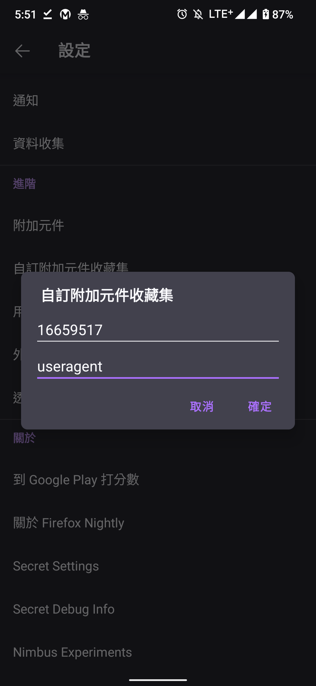

# 如何在安卓使用實驗室(Erolab)的雲玩 

**注意：工口平台並沒有雲玩，所以只適用於EROLAB**

## 第一步
這個步驟可以省略，直接應用我已經弄好的收藏
ID: 16659517
收藏名字: useragent

打開這個 如果你要創新帳號，使用自己的收藏

[User Agent Switcher扩展](https://addons.mozilla.org/zh-CN/firefox/addon/uaswitcher/)

## 第二步

去谷歌商店下載 **Firefox Browser(Nightly For Developers)**

### 第三步

打開剛下載的FF(FireFox) > 右下角設定 > 關於 Firefox Browser

標誌按5下
 
下面會跳出“已開啟除錯選單”

## 第四步

退回去設定，就會多了進階，按下“自訂附加元件收藏集”

輸入ID和收藏名字

或者應用我的

成功後會顯示以下，然後自動結束FF

## 第五步

回到總頁面按下右下角

選

切換去蘋果

## 最後一步

打開EROLAB網站，就會出現以下選擇

登入你的帳號就能玩了
