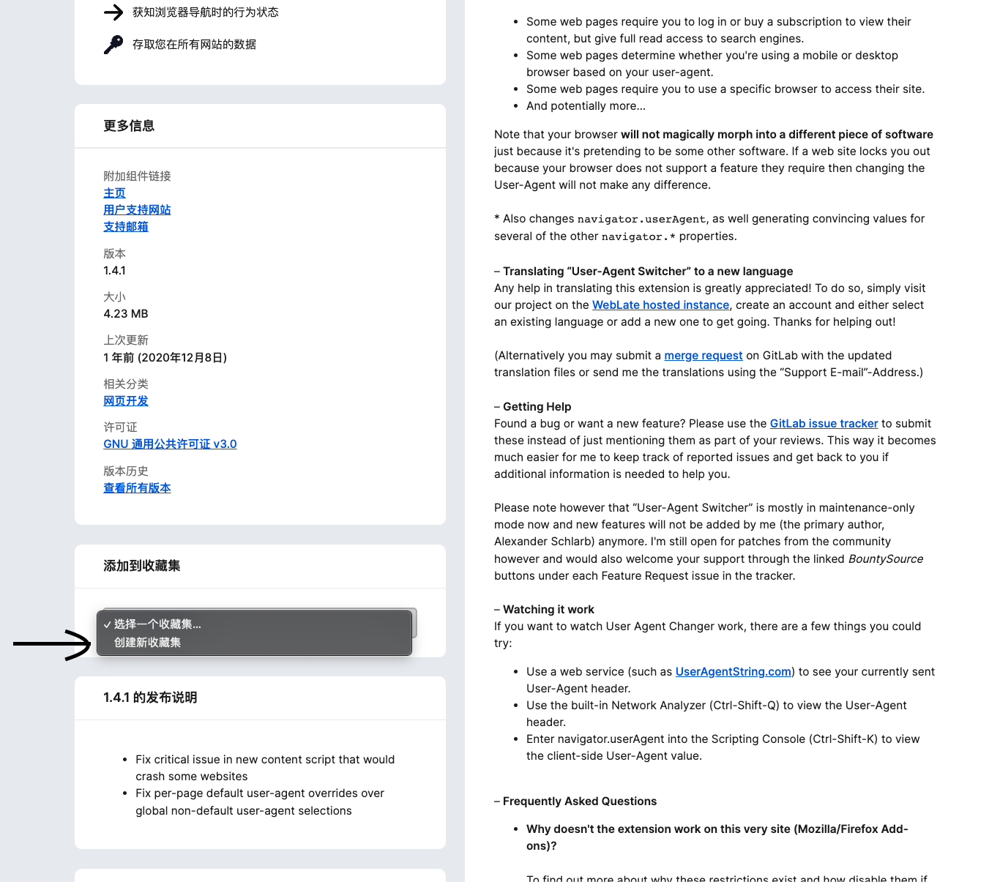
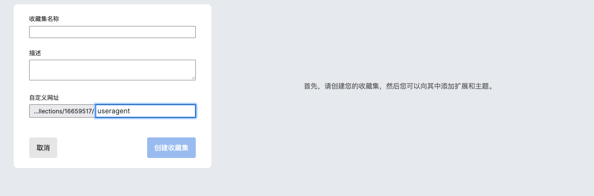
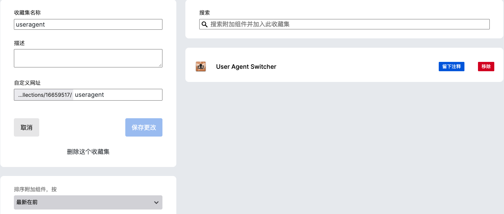

# 如何在安卓使用實驗室(Erolab)的雲玩 

**注意：工口平台並沒有雲玩，所以只適用於EROLAB**
**FF = Firefox**
## 第一步
這個步驟可以省略，直接應用我已經弄好的收藏 
ID: 16659517 
收藏集名稱: useragent 

如果你不想要使用我的，請打開這個 

 

首先你要在Firefox網站先**創新帳號**，然後去以下網址

[User Agent Switcher扩展](https://addons.mozilla.org/zh-CN/firefox/addon/uaswitcher/)

**注意：自定義網址：數字為你的用戶ID，後面填寫的為你的收藏名字**
**上面兩個選項（收藏集名稱和描述）沒意義，你隨便填**

成功的畫面

## 第二步

去谷歌商店下載 **Firefox Browser(Nightly For Developers)**

## 第三步

打開剛下載的FF(FireFox) > 右下角設定 > 關於 Firefox Browser

標誌按5下
 
下面會跳出“已開啟除錯選單”

## 第四步

退回去設定，就會多了進階，按下“自訂附加元件收藏集”

輸入ID和收藏名字

或者應用我的

成功後會顯示以下，然後自動結束FF

## 第五步

回到總頁面按下右下角

選

切換去蘋果

## 最後一步

打開EROLAB網站，就會出現以下選擇

登入你的帳號就能玩了

### 問題

 什麼是user-agent？ 

後台會讀取user-agent來辨認你是什麼平台. 

安卓的例子：
Mozilla/5.0 (Linux; Android 12) AppleWebKit/537.36 (KHTML, like Gecko) Chrome/101.0.4951.41 Mobile Safari/537.36
愛瘋的例子：
Mozilla/5.0 (iPhone; CPU iPhone OS 12_2 like Mac OS X) AppleWebKit/605.1.15 (KHTML, like Gecko) Mobile/15E148

更改了就能騙布魔雲玩以為你是IOS，就會讓你登入

 這樣弄有危險嗎？ 

不會，不想用了直接刪掉FF

 Chrome能不能這樣弄？

初次嘗試時並沒有搜到chrome可以更改user-agent. 如果真有這個需求，我才試試吧

 為什麼不能直接下載擴展？

由於新的FF限制了擴展，所以只有推薦的擴展能直接下載. 因此，需要下載DEV版自己手動貼加.

 用自己的收藏和用我的有什麼差別？ 

差別在那天我刪了我的收藏，你就要自己弄了

### 注意以後

- 官方可能會封這方式 （雖然我不懂怎麼封）
- 共用收藏不懂會不會有限制 （我是覺得不會）