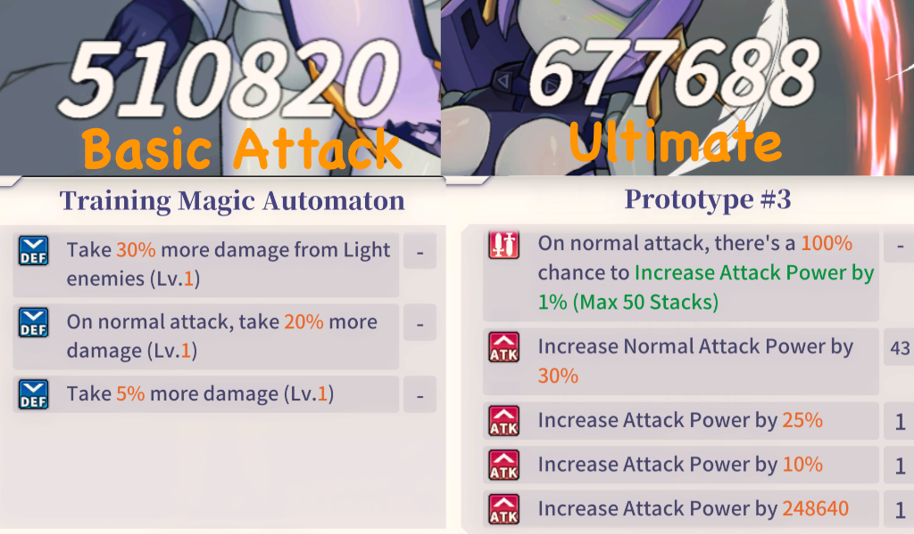

# The guide for how to play the Tenkafuma "properly"

> Why play for meta in R18 game?

\- By most of the players

#### BUT ! 
If you want to git-gud on this ~~mathematic~~ R18 game, this guide cover all the basic mechanic of the game that you should know (probably?).

### Wording 
T + number = which turn
T4 = Turn 4

4n + 1 = Repeation of turn
Where n = 1,2,3,4,5, hence 4n+1 = T5,T9,T13,T17 and so on...

ATTACK = BASIC/ULTIMATE
Some healer/supporter apply their buff regardless of basic or ultimate. Exception: S.Lulu, Noel, W.Chizuru. These unit lose their buff from basic if you use ultimate instead. 

There are 2 type of damage buff:
- Buff with % on self attack power (Raw number)
- Percentage attack power buff (%)

I will refer them as RawNumBuff or %Buff

### Understand the character's move order [IMPORTANT]

Most of the healer/supporter in this game have attack buff skill. Hence, they always move first before those who attack.

In most case, %buff goes before RawNBuff. Also, there is one rule, you should move buffer with orders of most left to side in most cases. (explanation on next section).

I will only talk about healer/supporter. For others, debuff always move before those who dont have. If you have multiple debuffers, then you need test it out because investment varied on different peoples. 

Straightforward Combo

SAKUYA ULT > DAPHNE ULT > X.LANA BASIC/ULT
If X.Lana low bond, occasionally, you can save her ult before burst turn to give Sakuya and Daphne %Buff first. 

HM.FIORA ATTACK > LULU ATTACK > NOEL BASIC
You don't use Noel ult otherwise you lose the buff.

Aiko + Daphne Combo

**BASIC:**
LULU > AIKO > DAPHNE

Reason:
You get more heal with Aiko if you use Lulu first. Daphne will be the third one so she maximized shield with both Aiko(10%) and Lulu(20% RawNumBuff).

**ULTIMATE:**

Assumming your daphne is Bond 3(CD3):
Turn 4: AIKO BASIC/LULU ATTACK > DAPHNE ULT
Turn 5: AIKO ULT > DAPHNE ULT > LULU ATTACK
You repeat every 3n+1. 
If your daphne is Bond1(CD4), then you will need to delay all unit 1 turn and do it 4n+1.

Why don't daphne ult before lulu move at Turn 4? You will want to maximize the buff to burst on next turn.

T4: AIKO BASIC > DAPHNE ULT > LULU ATTACK
T5 Buff:

T4: AIKO BASIC/LULU ATTACK > DAPHNE ULT
T5 Buff:

S.Lulu

### Understand the positioning [IMPORTANT]

A general rule is always put your healer/supporter on the most right side.

If you want to understand the theo

### Understand the equation 

**Same category of buff is addition/substraction, not multiplication.**
Example:
if Enemy has (Take 50% less damage + Take 20% more damage), Enemy will take 70% damage only.
Multiple attack buff of 20%,30%,40% on a single unit will yield total 90% attack buff.

**True damage goes through shield. It can only be reduce by guarding + guarding buff.**
Example: 
180% HP true damage x 50%(Guard) = 90% HP loss

If enemy deal 200% HP true damage, you will die even with guarding. 200% x 50%(Guard) = 100% HP loss

Some exception: Satan have 10% less damage while in guard stance. She will take 200% x (100% - 50% - 10%) = 80% HP loss.

**Note: Most instant kill mechanic implement 500% true damage, even Satan Lead die. (500% x (100%-50%-10%-15%) = 125% HP loss).**  

You do not need to know the equation. Just use it as reference.

Attack Power

Attack Power = (Character's Attack Power x Increase Attack Power by X%) + Attack Power buff (Raw number)

Damage

Damage = Attack Power x Ultimate %/(100% +/- Basic Attack Damage %) x (100% +/- Attribute buffs/debuffs X%  (100% +/- Deal more/less damage %) x (100% +/- Take more/less damage +/- Take more/less damage from Damage over Time(DOT) ) x (100% +/- Take more/less damage from X Attribute)

Damage Example
: 
![prototype #3 Attack][]

Damage = (626) x 100%(Basic Attack Power %) = 626
 

Damage = (626 x 136%) + 184178 
= 185029.36
**Note: If attack have 75% on basic, then it's going be (626 x 75% x 136%). Skipping digit because 100% = 1**
 

Attack Power = ((626 x 100%+25%+10%) + Basic Power 100% + 248640)
**Basic attack**
Damage = 249491 x 150%(Basic damage buff) x 105%(Enemy take more damage) x 130%(More damage with Light)
= 510820.74
**Ultimate**
Damage = 249491 x 199%(Ultimate %) x 105% x 130%
= 677688.85 

## Common Question

Why do people always recommend Daphne as starting character?

It's because Daphne offer everything you need.

