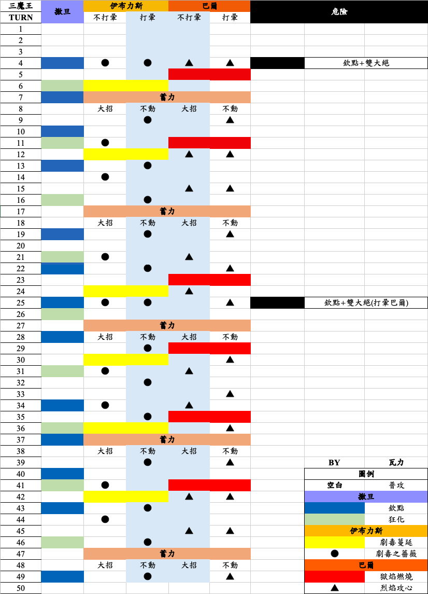

# 時裂第五季 SP01

### 敵人行動表 by Discord 群 蝦佬(皮皮蝦)

##### 行動：撒旦 > 伊布 > 巴爾

### 撒旦

#### 基礎攻擊力：574361

| 開場被動                     |
| :----------------------------------------------------------- |
| 受到傷害減少 50%                                             |
| 被攻擊時，有 100%機率觸發【以攻擊力 100%對目標進行反擊】效果 |
| 免疫沈默                                                     |
| 免疫麻痹                                                     |
| 必殺技 CD 變動效果免疫                                       |

|  技能 |  目標 |  效果                                                                                                    |
| :------------------------------------ | :------------------------------------ | :--------------------------------------------------------------------------------------------------------------------------------------- |
| 撒旦的欽點                            | 你婆 HP 最大值                        | 嘲諷，使敵人強制攻擊自身 2T 受到傷害增加 30% 3T                                                                                       |
| 狂暴姿態                              | 撒旦自身                              | 攻擊力增加 50% 1T 受到傷害增加 50% 1T 嘲諷，使敵人強制攻擊自身 2T 被攻擊時，有 100%機率觸發【以攻擊力 50%對敵全體進行反擊】效果 |

|  發動時機  |  技能 | 效果 |
| :----------------------------------------- | :------------------------------------ | :----------------------------------- |
| 50%血量以下                                | 力量強化                              | 攻擊力增加 70% 永久性                |
| 巴爾死亡                                   | 回復強化                              | 每回合以自身最大 HP5%進行治療 50T    |
| 伊布死亡                                   | 肉體強化                              | 受到傷害減少 25% 50T                 |

### 伊布

#### 基礎攻擊力：897439

| 開場被動                            |
| :------------------------------------------------------------------ |
| 免疫【麻痹，睡眠】                                                  |
| 攻擊時，有 100%機率觸發【使目標被治療時回復量減少 33%(1 回合)】效果 |
| 被攻擊時，有 100%機率觸發【使目標攻擊力減少 15%(3 回合)】效果       |
| 必殺技 CD 變動效果免疫                                              |

|  技能 |  目標 |  效果                          |
| :------------------------------------ | :------------------------------------ | :------------------------------------------------------------- |
| 劇毒之薔薇                            | 你婆當前最低 HP%                      | 175%攻擊力單體傷害                                             |
| 劇毒蔓延                              | 你婆當前最高 HP%                      | 225%攻擊力單體傷害 對目標附上【被治療時獲得回覆量減少 30%】 |

|  發動時機  |  技能 | 效果                                                                             |
| :----------------------------------------- | :------------------------------------ | :--------------------------------------------------------------------------------------------------------------- |
| 50%血量以下                                | 儲存魔力釋放                          | 攻擊時，有 100%機率【使我方全體攻擊力增加 10%(最多 50 層)】效果 50T   造成傷害時會以傷害值 50%回復自身 HP 50T |
| 巴爾死亡                                   | 薔薇之刺                              | 被攻擊時，有 100%機率觸發【使目標被治癒時回復量減少 30% 2T】效果                                                 |
| 撒旦死亡                                   | 薔薇之刺                              | 被攻擊時，有 100%機率觸發【使目標攻擊力減少 25% 2T】效果                                                         |
| 蓄力                                       | 魔薔薇散落                            | 以 200%攻擊力對你婆全體造成傷害 對你婆全體附上【攻擊力減少 25% 永久性】                                       |

### 巴爾

#### 基礎攻擊力：825644

| 開場被動                         |
| :--------------------------------------------------------------- |
| 免疫【沈默，睡眠】                                               |
| 必殺時，有 100%機率觸發【使我方全體攻擊力增加 15%(15 回合)】效果 |
| 被攻擊時，有 100%機率觸發【使目標受到傷害增加 15%(3 回合)】效果  |
| 必殺技 CD 變動效果免疫                                           |

|  技能 |  目標 |  效果                      |
| :------------------------------------ | :------------------------------------ | :--------------------------------------------------------- |
| 烈焰攻心                              | 你婆 3 位                             | 180%攻擊力單體傷害                                         |
| 獄焰燃燒                              | 你婆 3 位                             | 180%攻擊力單體傷害 對敵附上【受到傷害增加 35%(4 回合)】 |

|  發動時機  |  技能 | 效果                                              |
| :----------------------------------------- | :------------------------------------ | :-------------------------------------------------------------------------------- |
| 50%血量以下                                | 時空逆流術式                          | 必殺時，有 100%機率觸發【使我方全體當前必殺技增加 1 回合】效果                    |
| 撒旦死亡                                   | 魔力強化                              | 攻擊力增加 70% 50T                                                                |
| 伊布死亡                                   | 魔力增幅領域                          | 攻擊時，有 100%機率觸發【使敵人全體攻擊力減少 5%(最多 50 層)】效果                |
| 蓄力                                       | 焚世烈焰                              | 以自身 200%攻擊力對你婆全體造成傷害 對你婆全體附上【受到傷害增加 25%(永久性)】 |

#### 如果你用控

**注：並無多次測試，不一定正確**

- 技能會被延遲：
  - 撒旦狂化（優先度大於欽點）
  - 伊布薔薇（沒測不知道）
  - 巴爾烈焰（優先度小於獄焰）
- 巴爾伊布蓄力後延遲的技能會重置，請看回上表
