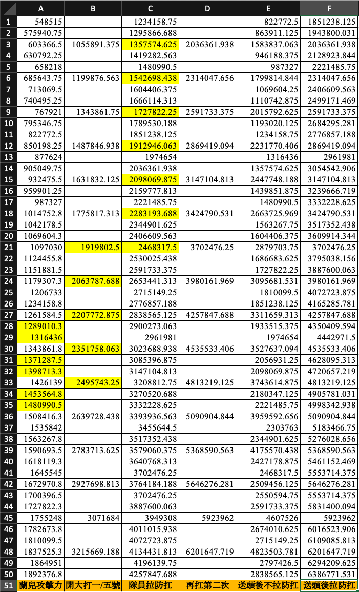

# 時裂第五季 SP03

## 巨錘？蘭兒

| <span style="color:blue">開場被動</span>                     |
| :----------------------------------------------------------- |
| 3 免疫                                                       |
| 必殺技 CD 變動效果免疫                                       |
| 免疫效果【被治療時獲得回復量減少（回合型）】                 |
| 每經過 1 回合時，觸發【清除自身的持續傷害效果】效果          |
| 屬性相剋增減效果減少 100%                                    |
| 每經過 1 回合時，觸發【使自身攻擊力增加 5%（最多 50 層）效果 |
| 被普攻攻擊時受到傷害增加 100%                                |
| 被必殺技攻擊時受到傷害減少 25%                               |
| 鎖血 1%                                                      |

| <span style="color:blue"> 技能</span> | <span style="color:blue"> 目標</span> | <span style="color:blue"> 效果</span>                          | <span style="color:blue"> 回合 </span> |
| :------------------------------------ | :------------------------------------ | :------------------------------------------------------------- | -------------------------------------- |
| 耀空斷裂斬                            | 你婆 1 號位                           | 175%攻擊力單體高傷<br>受到傷害增加 20% 永久性                  | 3n                                     |
| 破甲重斬                              | 你婆拉防                              | 225%攻擊力單體高傷<br>受到傷害增加 50% 9T<br>攻擊力減少 50% 5T | -                                      |
| 最佳狀態                              | 蘭兒                                  | 清除自身受到傷害增加效果                                       | 12n                                    |

| <span style="color:blue"> 發動時機 </span> | <span style="color:blue"> 效果</span> |
| :----------------------------------------- | :------------------------------------ |
| 同一回合超過 3 大招                        | 蘭兒【必殺技傷害增加 25% 】9T         |
| 任意成員拉防                               | 蘭兒發動【破甲種斬】                  |

| <span style="color:blue">第一階段</span>                  |
| :-------------------------------------------------------- |
| 蘭兒只會攻擊 1 號位，死亡後目標就輪到下一個（2，3，4，5） |
| 只有 1 號位能造成傷害，其他成員被鎖（-500%造傷）          |

| <span style="color:blue">第二階段（1%HP）再戰氣勢！</span> |
| :--------------------------------------------------------- |
| 回血到 25%                                                 |
| 蘭兒只攻擊 5 號，死亡後目標就輪到下一個（4，3，2，1）      |
| 1 號位被附上-500%造傷                                      |
| 五號位 【造成傷害增加 35%】 永久性                         |
| 你婆全體 【攻擊力減少 15%】 50T                            |
| 蘭兒【受到最終傷害減少 40%】 50T                           |

| <span style="color:blue">有隊員死亡</span>                         |
| :----------------------------------------------------------------- |
| 蘭兒自身附上【造成傷害增加 50%】永久性                             |
| 每當蘭兒斬殺一人，下一回合會喊話（無行動），後個一回合才會繼續攻擊 |
| 你婆全體【攻擊力減少 35%】                                         |
| 一階段送人頭的話，將導致無法清除二階段 1 號位被附上的-500%造傷     |
| 二階段送人頭的話，將清除 1 號位的【-500%造傷】                     |

| <span style="color:blue">小技巧（機制）</span>                |
| :------------------------------------------------------------ |
| 在 12N 進入第二階段，蘭兒不會釋放技能【最佳狀態】             |
| 縮 T 可以在進入二階段前的回合送人頭，蘭兒會進入階段然後才喊話 |

### 蘭兒每個階段的攻擊（基礎傷害）



```
只有1號位能攻擊，建議用隊長特化型的，例如花巴，凱撒
儘量不要被附上太多的永久易傷在1號位，隊員可以在3N拉防分擔傷害，低練可以參考表判定承受能力
因為2-3-4位不會被攻擊，1等隊員都可以上場
如果有帶劍聖之類疊易傷很久的，建議在12N進入第二階段跳過最佳氣勢
```
