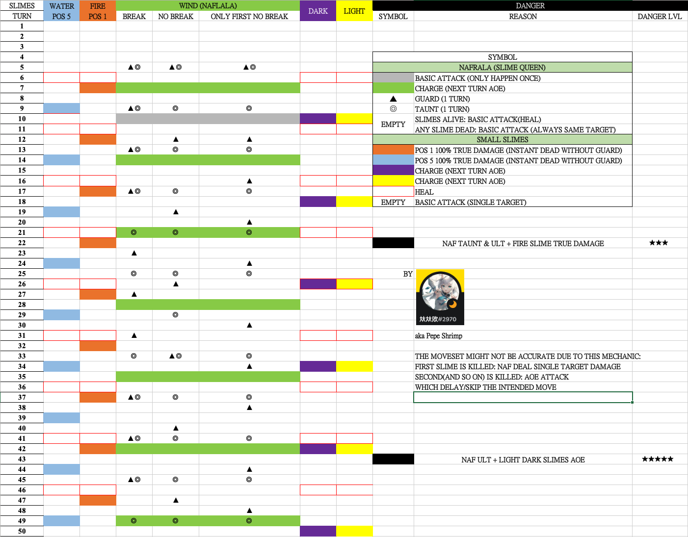

# Guide on SP3
## Slime Queen & Small Slimes
##### [Stage Recommend Lvl 60 Pot 12]
###### I recommend at least 2M HP and 3 same attribute. This stage Wind team is impossible.

## MOVESET

1. On turn 1, small slime will apply buff **[]** to Naf.
2. Fire & Water will deal true damage on Pos 1 & 5 (Can be taunt). Light and Dark will charge together and deal AOE damage. 
3. Straight forward fight. Bring at least 3 same **attribute** teammate(your main dps). Kill **attribute** small slime then kill queen, other will leave once Queen is dead. [Attribute: Fire/Light/Dark/Water]
4. Drag on fight(20T+) is very danger because small slime apply debuff on you every turn **[]**. 
5. **FOR LACK OF UNIT/LOW INVESTMENT** Tank on pos 5 can be use to taunt Fire slime true damage skill. **Note:** Taunt also absorb debuff from every small slime, too much debuff will kill your tank. 
6. **FOR NON-FIRE TEAM** On Turn 21, Naf will taunt & charge + fire slime true damage on pos 1 next turn. You wouldn't able to break Naf charge if you only bring 3 same attribute and one of them is at pos 1(which you need to guard). If you can't break and can't tank Naf, then you will need to kill fire slime.

#### Mechanic that you probably don't need to know
7. 

8. On Turn 42 (you aren't suppose to reach here), Naf will charge + light & dark charge. Triple charge and you can only break 1. This is not tankable without massive shield.

Take 200% less damage from Wind enemies
Decrease attribute buffs/debuffs by 70%
