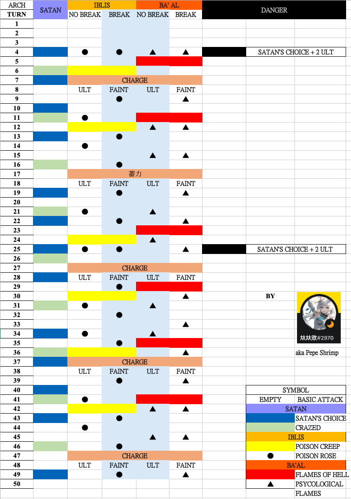

# Guide on SP2
## The 3 Archdemon Satan, Iblis, Ba'al
##### [Stage Recommend Lvl 60 Pot 12]

## Moveset

## Archdemon Satan
- Take 50% less damage
- When Attacked, there's a 100% chance to perform a counter attack on all enemies for 100% of your attack power
- Silence Immunity
- Paralysis Immunity
- Immunity to CD changes

#### [Crazed]
- When attacked, there's a 100% chance to perform a counter attack on all enemies for 50% for your attack power.
- Take 50% more damage

#### [Satan Choice] (Apply effect on the target with lowest Max HP)
- Taunt, force the enemy to attack you
- Take 30% more damage

#### 50% HP below trigger [Power Enhance] 
- Increase Attack Power by 70%

#### Iblis Dead trigger [Prowess Enhance] 
- Take 25% less damage

#### Ba'al Dead trigger [Recovery Enhance] 
- Recover 5% HP every turn

## Archdemon Ba'al
- Silence Immunity
- Sleep Immunity
- On Ultimate Skill, there's a 100% chance to increase party's Attack Power by 15% for 15 turns 
- When Attacked, there's a 100% chance to Target takes 15% more damage for 3 turns 
- Immunity to CD changes

#### [Flames of Hell]
- Target position 3
#### [Psycological Flame]
- Target position 3

#### 50% HP Below trigger [Space Time Contortion]
- On ultimate skill, there's a 100% chance to increase party's current ultimate skill cd by 1

#### Iblis dead trigger [Magic Increase Area]
- On attack, there's a 100% chance to Decrease all enemies Attack Power by 5% (Max 50 Stacks)
#### Satan dead trigger [Magic Enhance] 
- Increase Attack Power by 70%

#### Charge [Raging Flames] 
- AOE damage to all enemies and apply Decrease attack power by 25% 

## Archdemon Iblis
- Paralysis Immunity
- Sleep Immunity
- On attack, there's a 100% chance to Reduce target's Recovery Rate by 33% for 1 turn
- When attacked, there's a 100% chance to Decrease target's Attack Power by 15% for 3 turns.
- Immunity to CD changes

#### [Power Creep]
- Target highest % hp 
#### [Power Rose]
- Target lowest % hp  
#### 50% HP below trigger [Power unleash]
- On attack, there's a 100% chance to increase party's Attack Power by 10%(Max 50 Stacks)
When dealing damage, recover HP equal to 50% of the damage dealt

#### Ba'al dead trigger [Poisoned Rose]
- When attacked, there's a 100% chance to Reduce target's Recovery Rate by 30% for 2 turns

#### Satan Dead trigger [Roxy Thorns]
- When attacked, there a 100% chance to decrease target's attack power 25% by 2 turns

#### Charge [Demonic Rose] 
- AOE To all enemies and apply - Take 25% more damage

 

Why do I keep dying?

Ba'al buff her team everytime she ult. If you can't kill them fast enough, try killing Ba'al first (best before 12T). 
 
Satan move > Iblis move > Ba'al move. If you don't have shield to keep all unit in full hp, satan attack hit your unit and iblis [poison rose] will follow up on the same target.

Why does Satan so hard to kill?

Satan have 50% less damage passive. The best turn to deal damage to her is during crazed (Take 50% more damage). You can bring debuffer like Mina/S.Shizuka. She heal 5% hp after Ba'al is dead and 25% less damage buff after Iblis is dead. It's best to bring reduce healer like S.nana, Caesar or OG.Shizuka if you want to slowly grind her down.

Team comp?

Meta: HM.Fiora, B.Baal, B.Satan, TM.Mina, Caesar
 
Non.Meta: HM.Fiora, B.Iblis
 
Not Recommend: H.Salucia 

 

**NOTE: NOT RECOMMEND Satan can be sleep, Ba'al can be paralyze, Iblis can be silence. Satan's choice[Skill] cannot be delay, happen 3n+1(Crazed take higher priorty). Other skills can be delay/skip. Ba'al and Iblis skill will reset to normal (check table) after charge end.**
