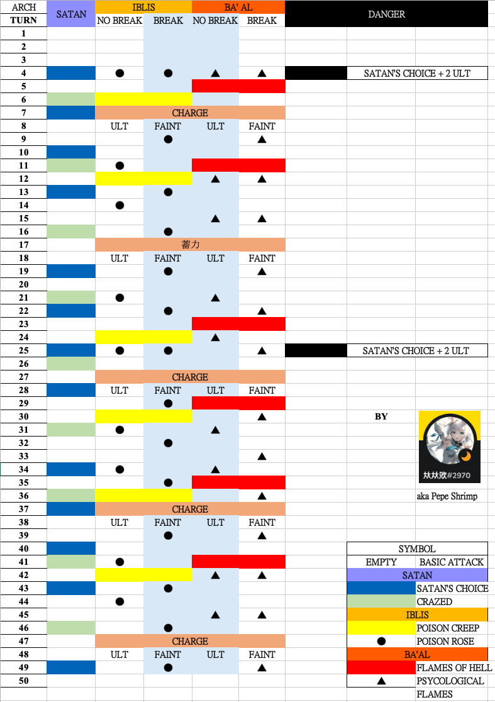

# Guide on SP2
## The 3 Archdemon Satan, Iblis, Ba'al
##### [Stage Recommend Lvl 60 Pot 12]
###### I recommend at least **2M HP** as minimum requirement. Possible to go lower with daphne but not recommended below 1.7M. 

## Moveset

1. It's **COMMON** to have unit **dead** due the high firing power of enemy or focus fire. 
2. Ba'al always target 3rd position. Recommended to guard to avoid iblis hit 3rd too coincidentally.
3. **NOT RECOMMEND**  Satan can be sleep, Ba'al can be paralyze, Iblis can be silence. Satan's choice cannot be delay, happen 3n+1(Crazed higher priorty). Other skill can be delay/skip. Ba'al and Iblis skill will reset to normal (follow table) after charge end. 
4. Break Ba'al if you want safer, Break Iblis if you want faster
5. The killing order dictate how fast/easy for you to complete it: 
 
##### The safest order - Ba'al, Satan/Iblis 
- Ba'al is a threat because of her skill **[5]** and it's stackable. Once it goes up to 3+ stacks, they might one shot your unit. Hitting her also debuff you unit **[7]**, avoid hitting her with your lowest HP unit(if it's attacker) before satan choice 
- Strongly recommend to bring the Daphne + Reduce recovery rate unit - Caesar, Summer Nana or OG shizuka 3* (not recommend)
- Satan will obtain buff **[4]** once Ba'al dead, you will need daphne shield to tank buffed counter damage **[2]**/sustain and reduce satan's healing. It's doable to not bring reduce recovery unit if you have enough firepower.
- Iblis is recommended to kill last because satan's buff **[3]** if iblis die first. Satan will have 75% total reduce damage and extremely hard to kill. It's doable to kill iblis second if you have strong dps to kill satan last.
- It's recommended to break Ba'al **[8]** instead of Iblis **[9]** to have better sustain.

##### The fastest path - Satan, Ba'al/Iblis
- If you have high investment unit, you can do this path. Kill Satan on Crazed T7 **[1]**, then kill whoever you want. Try to kill them asap. Iblis + Ba'al **[6]** might instant kill 3rd pos even if you guard.

5. Safe comp (max hp buff on lead): 
Hm.Fiora Lead + Daphne + 3 Attackers 
**(Extremely slow if you dont burst on crazed/bring debuffer)**
Hm.Fiora + defender (suggest budget tank water Leona Pos3 to tank Ba'al) + 3 attackers
Tm.Mina + Daphne
6. Good comp (Meta, Fast & Easy with decent investment):
Tm.Mina + Light attackers, B.Satan, B.Baal, Caesar
7. No longer meta comp: 
Slulu, S.Nana + Tyrella (Both lead skill additional attack wont trigger Satan's counter attack)

## Archdemon Satan
- Take 50% less damage
- When Attacked, there's a 100% chance to perform a counter attack on all enemies for 100% of your attack power
- Silence Immunity
- Paralysis Immunity
- Immunity to CD changes

### Skill
#### Crazed [1]
- When attacked, there's a 100% chance to perform a counter attack on all enemies for 50% for your attack power.
- Take 50% more damage

#### Satan Choice (Target on the lowest Max HP)
Apply effect on the target
- Taunt, force the enemy to attack you
- Take 30% more damage

#### 50% HP below trigger [Power Enhance] [2]
- Increase Attack Power by 70%

#### Iblis Dead trigger [Prowess Enhance] [3]
- Take 25% less damage

#### Ba'al Dead trigger [Recovery Enhance] [4]
- Recover 5% HP every turn

## Archdemon Ba'al
- Silence Immunity
- Sleep Immunity
- On Ultimate Skill, there's a 100% chance to increase party's Attack Power by 15% for 15 turns **[5]**
- When Attacked, there's a 100% chance to Target takes 15% more damage for 3 turns **[6]**
- Immunity to CD changes

### Skill
- To be added

#### 50% HP Below trigger [Space Time Contortion]
- On ultimate skill, there's a 100% chance to increase party's current ultimate skill cd by 1

#### Iblis dead trigger [Magic Increase Area]
- On attack, there's a 100% chance to Decrease all enemies Attack Power by 5% (Max 50 Stacks)
#### Satan dead trigger [Magic Enhance] [7]
- Increase Attack Power by 70%

#### Charge [Raging Flames] [8]
- AOE damage to all enemies and apply Decrease attack power by 25% 

## Archdemon Iblis
- Paralysis Immunity
- Sleep Immunity
- On attack, there's a 100% chance to Reduce target's Recovery Rate by 33% for 1 turn
- When attacked, there's a 100% chance to Decrease target's Attack Power by 15% for 3 turns.
- Immunity to CD changes

### Skill
- To be added

#### 50% HP below trigger [Power unleash]
- On attack, there's a 100% chance to increase party's Attack Power by 10%(Max 50 Stacks)
When dealing damage, recover HP equal to 50% of the damage dealt

#### Ba'al dead trigger [Poisoned Rose]
- When attacked, there's a 100% chance to Reduce target's Recovery Rate by 30% for 2 turns

#### Satan Dead trigger [Roxy Thorns]
- When attacked, there a 100% chance to decrease target's attack power 25% by 2 turns

#### Charge [Demonic Rose] [9]
- AOE To all enemies and apply - Take 25% more damage
